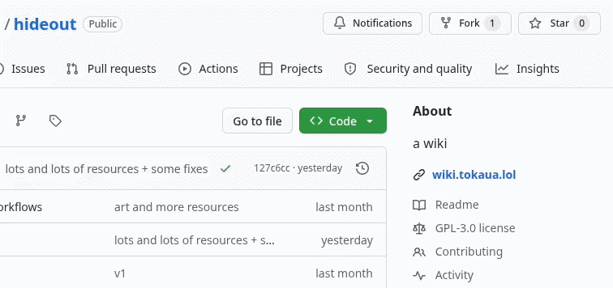

## Contributing
If you want to contribute, please read this thoroughly!

First, you must fork the repository, which you can do so by clicking [here](https://github.com/tokaualol/hideout/fork), or the "Fork" button at the top-right corner of the main repository page.



Once you have created the fork, I recommend using [git](https://github.com/git-guides) in order to [clone](https://docs.github.com/en/repositories/creating-and-managing-repositories/cloning-a-repository) your repository.

Before you make any changes, please read the [requirements](#requirements) in order to make sure you changes will be accepted!

After you've made your changes, remember to [push](https://docs.github.com/en/get-started/using-git/pushing-commits-to-a-remote-repository) them to GitHub!

Now, create a pull request [here](https://github.com/tokaualol/hideout/pulls), and check the boxes and fill in any placeholders.

Finally, wait for your contributions to be merged and make sure you haven't been asked to make any changes!

## Requirements

1. Check to see if the resource you are adding is already listed, we don't want any duplicates, alternatives are OK!

2. When adding something to a page, please follow this format.
```
[NAME](https://link-to-tool)<br>
description of thing
```

3. If the resource you are adding doesn't have any FREE or open-source options, you must add :currency: to indicate that it is paid only.
```
:currency: [NAME](https://link-to-tool) (1)<br>
description of thing
{ .annotate }

1.  Pricing: $9.99<br><br>Payment Methods:
<br>Credit Card, PayPal, Google Pay
```

4. If the resource you add is software, and doesn't have source code available, please make sure what you are adding is safe, run it through [VirusTotal](https://virustotal.com) at the bare minimum, or do your own analysis.

5. Add yourself to the contributors list in [credits](credits.md) :]