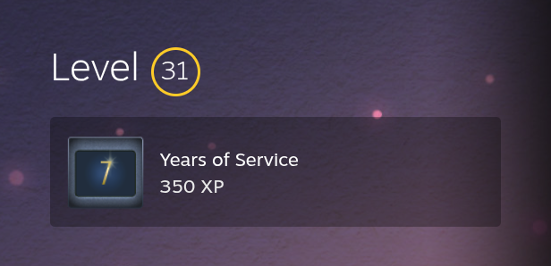

## VALVE
<hr>

[SteamDB](https://steamdb.info)<br>
Database covering the entire Steam catalog. Player charts, price history across all regions, update histories, and detailed data for every product.

[Steam Status](https://steamstat.us)<br>
Steam server status.

[SteamID](https://steamid.uk)<br>
Steam profile lookup with history.

[Valve Archive](https://valvearchive.com)<br>

[ChatterBox for Source](https://ralphorama.github.io)<br>
Generate a list of say binds that rotate.

[VPKEdit](https://github.com/craftablescience/VPKEdit)<br>
A CLI/GUI tool to create, read, and write several pack file formats.

[Source 2 Viewer](https://s2v.app)<br>
View, export, and decompile Source 2 assets.

<hr>
Remove Featured Badge on profile (1)
{ .annotate }

1. 1. Edit Profile<br>
    2. Featured Badge<br>
    3. Paste in Console<br>
    4. Save


```js
var access_token =  $J("[data-loyaltystore]").data("loyaltystore").webapi_token;
var badgeid = 0;

SetFavoriteFeaturedBadge(access_token, badgeid);

function SetFavoriteFeaturedBadge(access_token, badgeid) {
    $J.post( 'https://api.steampowered.com/IPlayerService/SetFavoriteBadge/v1?', {
        access_token: access_token,
        badgeid: badgeid
    });
} 
```
<hr>

## Counter-Strike

[CSFloat Market Checker](https://chromewebstore.google.com/detail/csfloat-market-checker/jjicbefpemnphinccgikpdaagjebbnhg)<br>
Shows the float value, paint seed, and more of Counter-Strike items on the Steam Market or Inventories.

[Skinshotter](https://skinshotter.com)<br>
View any CS2 skin in true-to-game 3D in a browser — rendered with Counter-Strike 2's own Source 2 shaders and in-game lighting, so float, pattern, and finish match the game exactly.

[NoLobbyReservation](https://github.com/honey-malviya/No-Lobby-Reservation)<br>
A SourceMod plugin which allows CSGO servers to be joinable again.

[csgo_gc](https://github.com/GT-610/csgo_gc)<br>
WIP Intelligent Game Coordinator for CS:GO

## Deadlock