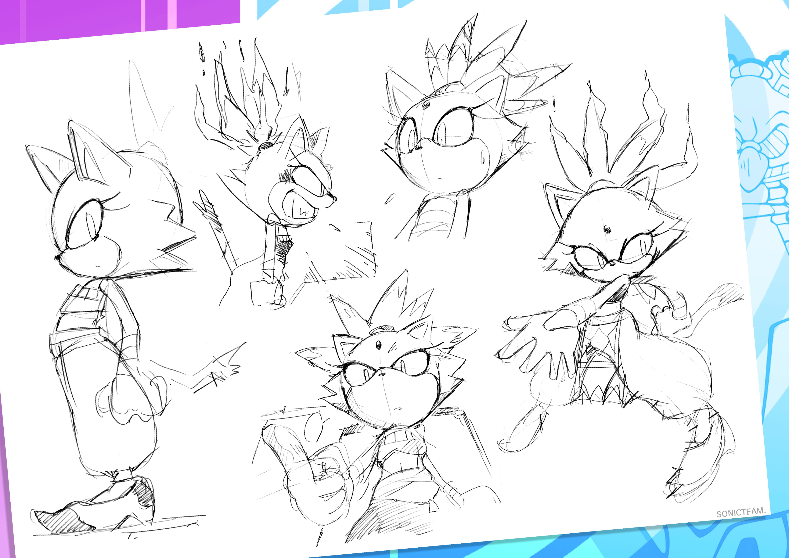
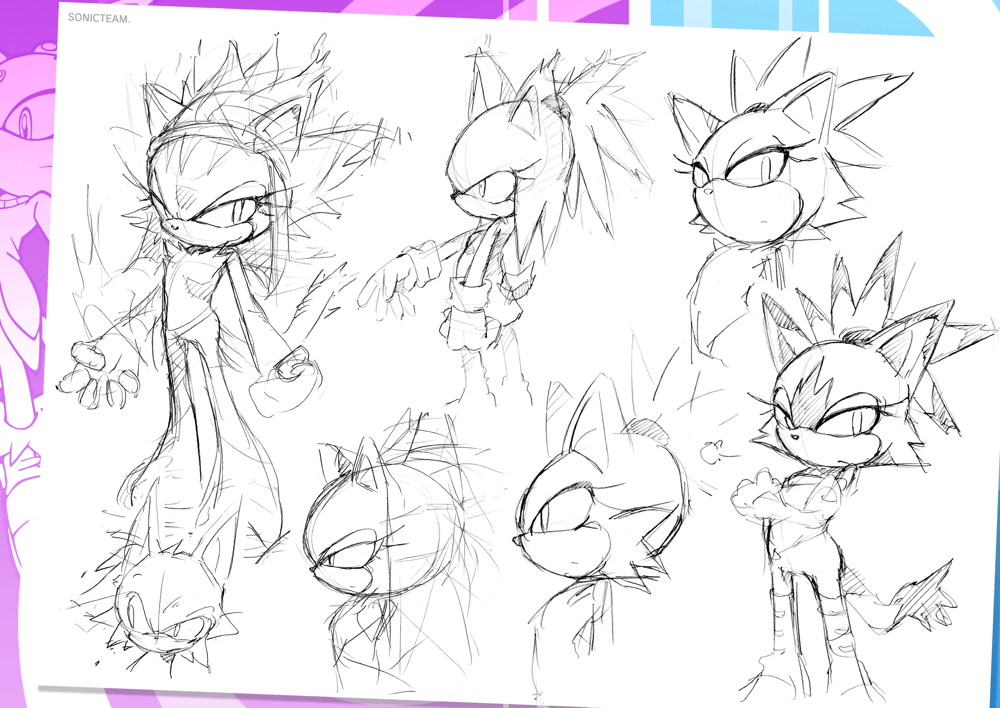
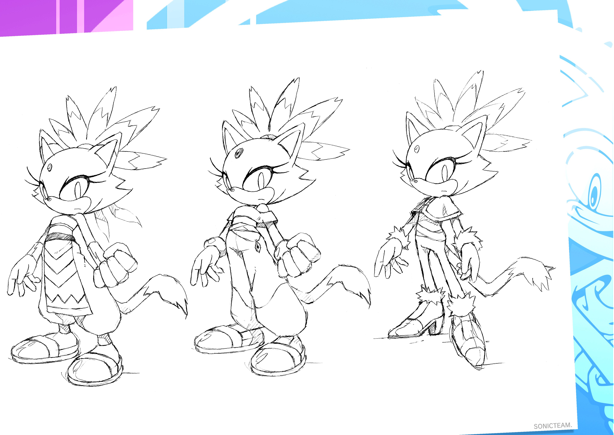
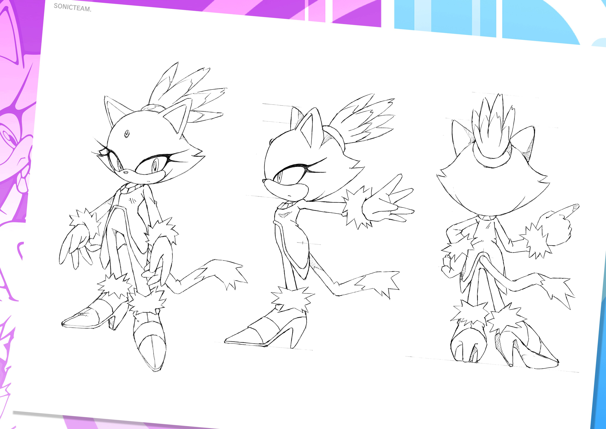
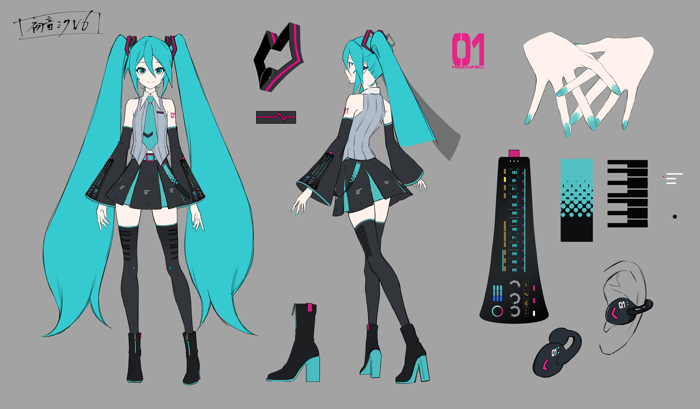
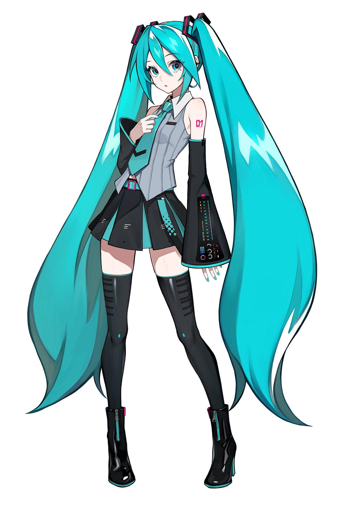
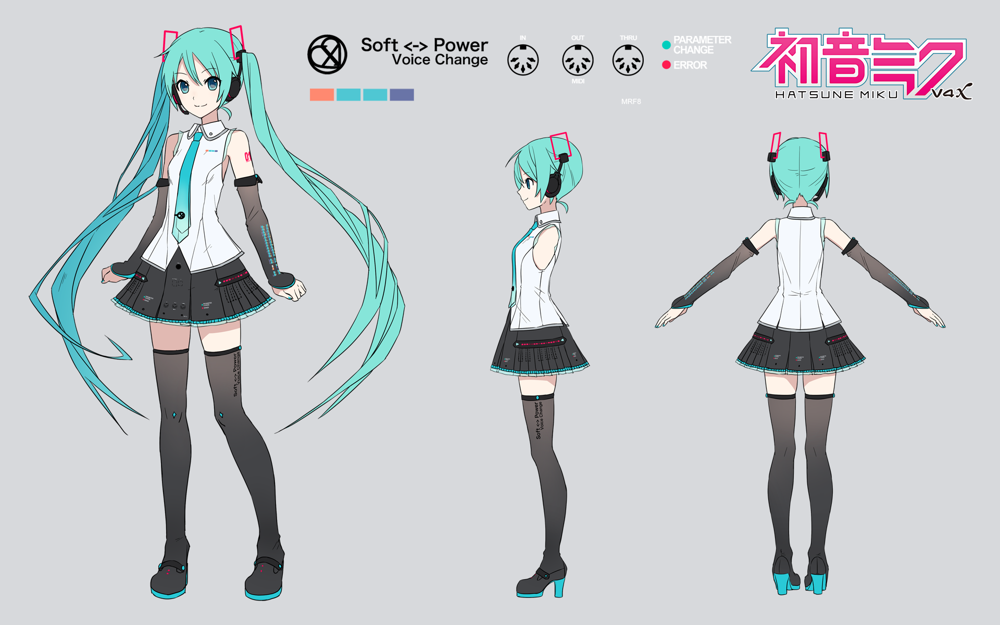
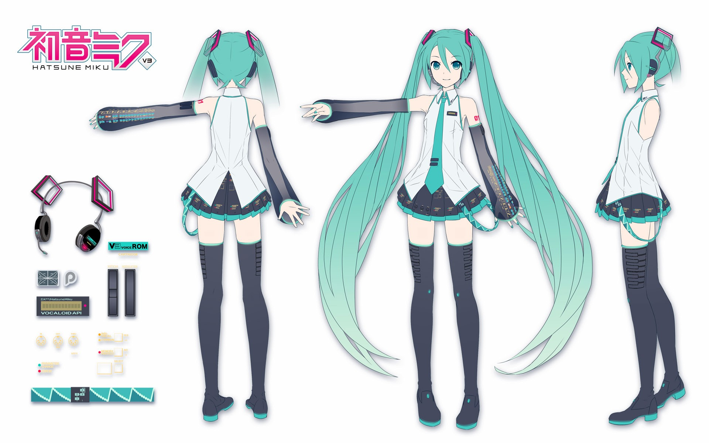

## Art

!!! warning

    There may be NSFW content on this page, or the pages linked.

## Reference / Character Sheets
Concept Art ~ Blaze the Cat 

- { loading=lazy }
- { loading=lazy }
- { loading=lazy }
- { loading=lazy }

## Hatsune Miku

#### V6

- { loading=lazy }
- { loading=lazy }
- { loading=lazy }

#### V4
{ loading=lazy }

####  V3
{ loading=lazy }

## My Little Pony
drawing tutorials, guides, and resources.

[https://ponepaste.org/8268](https://ponepaste.org/8268) 
/bale/ guides and tutorials

[https://mares.horse/p/drawingtutorials](https://mares.horse/p/drawingtutorials.html) 
Pony Drawing Tutorials & References [NSFW Warning]

[https://pony.tube/c/bale_stuff/videos](https://pony.tube/c/bale_stuff/videos) 

[https://mlpvector.club/cg/pony](https://mlpvector.club/cg/pony) 
A searchable list of character palettes from the series.

[https://ponepaste.org/9401](https://ponepaste.org/9401) 