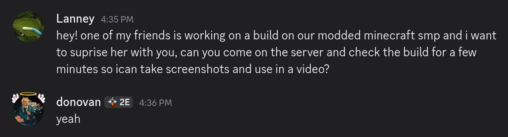
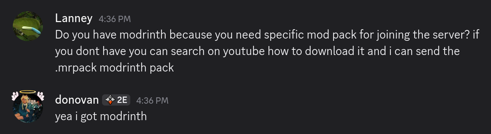
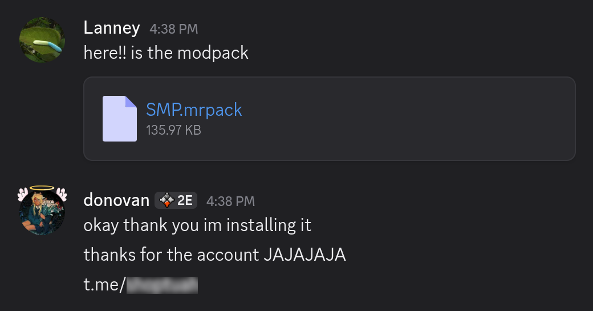

## Scams
A list of common methods used to scam, hijack accounts, and other misleading promises.

## Minecraft Modpack
If you ever recieve a random message from a friend that wants you to specifically join a Modded Minecraft server. You should take precautionary measures in order to make sure you are speaking with your friend and not someone who has hijacked their account.

{ loading=lazy }

If they message you, you should ask basic questions they should be able to answer quickly, like "how long have we known each other", or other specific questions only they would know. A good thing to check is if any usual mannerisms they do are no longer present while typing.

{ loading=lazy }

They will typically ask you to install a Modrinth or Curseforge modpack, usually ending in the file extension `.mrpack` for Modrinth. or `.zip` for anything else.

{ loading=lazy }

These are legitimate formats that Modrinth and Curseforge use, however the catch is that anyone can easily make them.
They can just put whatever mods inside of these packs that usually have some sort of malware.

The moment you launch this Minecraft instance in your launcher, your computer and any accounts you may have are at risk of being compromised.

Since Minecraft mods are just `.jar's`, they can add whatever code they want and it's like any other computer program.

Here is an example of a malicious decompiled mod.
{ loading=lazy }

Once they compromise your computer, these mods will search for any accounts that they can steal, usually stuff like Crypto wallets, Discord accounts, or browser cookies.
Then they most likely sell these accounts to cheap for others to use malicously, or if you are a high valued victim, go through these accounts and extort you for any important or confidental information they may have as their main motive is $$$.

In this case they will use your Discord account, to repeat the process, and send this same malicious modpack to YOUR friends.

## Sponsorship Email

## Artist Commission

## Discord Server Verification

## Fake Steam Login's